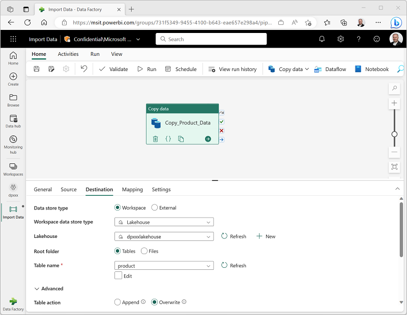

# Data Factory

To orchestrate different ETL processes creating a pipeline of activities.

## Pipelines

- Can be parameterized.
- Each execution creates a pipeline run with an ID.
- Run historial with detailed info about each run.
- Templates available for common tasks.
- Validate option to check is correctly configured.
- Can be scheduled.

## Activities

Executable tasks in a pipeline. Can have different outcomes (Like success, failure, completion) and be interconnected in different ways. 
Two types:
    - Data transformation activities: Copy or delete data, Dataflow Gen2, Fabric Notebook or job definition and stored procedure or script in a SQL database.
    - Control flow activities: Manage variables, run scripts, if loops, send message, called services, etc.

### Copy Data activity

Copy data between a source and a destination or sequencial activities in the pipeline.

## Connect a notebook

A notebook cell, using "Toggle parameter cell", can configure the cell so that the variables declared in it are treated as parameters when running the notebook from a pipeline.

Passing parameters in a pipelines will overwrite values declared in the notebook.

