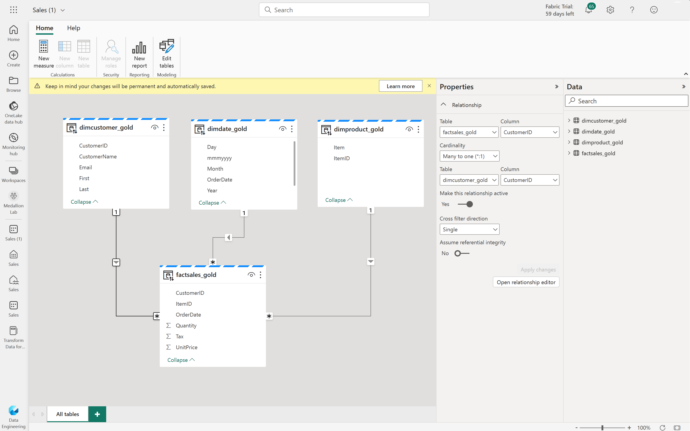

# Microsoft Fabric
End-to-end analytics platform for data and business professionals.
- To ingest, store, process and analyze data.
- **SaaS**, resources can be scaled up and down as needed.
- Included a **low-to-no-code** apporach.
- Data stored in a single open format in OneLake.
- Scalable, cost-effective and updated.
- Administrated in the **admin center**.
- Integrated with **Microsoft Purview Information Protection** that classify and protect sensitive data.
- Built on PBI and Azure Data Lake Storage with capabilities of Azure Synapse Analytics, Azure Data Factory, Azure Databricks and Azure Machine Learning.

Thought to create a medallion architecture (In one or several lakehouses):
- Bronze layer: Raw, unchanged data.
- Silver layer: Transformed, consistent and validated data.
- Gold layer: Extra modification to comply with requirements, like aggregations (Could be in a data warehouse).

Each business organization has one tenant, and that tenant has one OneLake, a data lake where is stored all Fabric data in Delta parquet format. Every Fabric items use data in OneLake (Lakehouse, data warehouse, etc.). It allows to have data centralized avoiding unnecessary duplication.

External files are recommended to be at least 4 MB.

### Set up
It needs to be enabled by and admin, either of these:
- Fabric admin (Former PBI admin)
- Power Platform admin
- Microsoft 365 admin

It can be enabled (In the Tenant settings) for the entire organization or for specific groups.
Groups are managed with **Microsoft 365** or **Microsoft Entra**.

### Admin Center
- Manage groups and permissions.
- Configure data sources and gateways.
- Monitor usage and performance.
- Access to the APIs and SDKs to automate tasks and connect other systems.
- Managed by the admin users.

Enabling users can be delegated by the admin.

### Workspaces
Folders to store any Fabric product items. Must have premium capacity to use Fabric.

## CI/CD tools in Fabric
- Git integration (https://learn.microsoft.com/en-us/fabric/cicd/git-integration/intro-to-git-integration)
- 

## OneLake
Lake-like architecture to store all Fabric data in one place.
- **OneCopy**: Component that allows to read data from one place, no need te duplicate it.
- Used by all Fabric components.
- Built on top of Azure Data Lake Storage (ADLS).
- Data can be stored in Delta, Parquet, CSV, JSON and others.
- Tabular data in delta-parquet format.
- Use of shortcuts no avoid data duplication.

## Shortcuts
Shortcuts point to data location in other place of fabric, or in other services (Within Azure or from other vendors)
Data does not need to be duplicated to be accesed.
Limited to the existing connectors, data must be ingested if no connector available.
Can be created in lakehouses and KQL databases.

## Synapse Data Engineering
Spark platform for data transformation at scale.

## Synapse Data Warehouse
SQL based and scalable data warehouse.

## Synapse Data Science
Azure Machine Learning and Spark to train and execute scalable data science models.

## Synapse Real-Time Analytics
To query and analize big data in real-time.

## Data Factory
Power Query with Azure Data Factory to integrate data.

## Power BI
Business intelligence tool

Can access different sources between Fabric:
  - Lakehouse data model

## Lakehouse
Data lake with a layer on top be se used as a data warehouse.
- **ACID transactions**support (Atomic, Consistency, Inolation, Durability).
Ways to ingest data:
  - Local files or folders.
  - Dataflows (Gen2).
  - Notebooks.
  - Data Factory Pipelines.
- Use of a schema-on-read, not a predefined one.

Ways to explore and ingest data:
  - Apache Spark: With Notebooks or Spark Job definitions usinf Scala, PySpark or Spark SQL.
  - Dataflow (Gen2).
  - Data Factory Pipelines.
  - SQL endpoint (Read-only).

Creating a lakehouse adds, besides the lakehouse object, two more objects:
  - Semantic model: Data model based on the tables in the lakehouse. It can be edited (Relations, measures, hierarchies, etc.) or other can be created.
  - SQL endpoint: To connect and read data with T-SQL using tools like SSMS. 

Acces is given at either the workspace or item level. It can be given only access to the SQL endpoint. In the endpoint, object-level security is also available.

### Tables in lakehouse
The lakehouse allows to create delta tables using Delta Lake technology.
The tables are based on the Delta Lake open-source technology, storage layer that allows for relational databases capabilities for batch and streaming analytics.
Tables are actually Parquet data files in the Delta format, with a schema abstraction.
For each table, there is stored in the lakehouse a folder with:
  - Parquet data files
  - _delta_Log folder where a transiction log is stored in JSON format.

Benefits of delta tables:
  - Can be created and modified using Apache Spark.
  - CRUD (Create, read, update, delte) operations supported.
  - ACID support.
  - Data versioning (With the transaction log) of the table. Time travel feature to see previous row version.
  - Streaming data support with the Spark Structured Streaming API, both as input or output (aka sink).

Delta tables can be used in many ways:
  - Apache Spark
  - Apache Spark SQL API (Query using SQL in Spark)
  - SQL analytics endpoints of the lakehouse

Types of tables:
  - Managed: Both table definition in the metastore and underlying data stored in the lakehouse.
  - External: Table definition in the metastore and a link to the data that is stored externally. Deleteing a table does not delete the data.

### Data model in a lakehouse

A data model can be created with the tables of the lakehouse. Used when live connecting PBI directly to the lakehouse in direct lake mode. It includes measures.

## Apache Spark
Open source parallel processing framework for large-scale data processing and analytics.
- The code initiates a driver program that uses SparkContext (Cluster management object) to manage of processing is distributed in the cluster.
- Code can be in Java, Scala, R, SQL or Python (default one).
- Spark sessions can be runned with notebooks or job definitions.
- RDD (Resilient distributed dataset) and then data structure and dataframe based on them (The ones usually used).

Included in other Azure offerings like Databricks, HDInsight or or Synapse Analytics. In Fabric, some extra functionalities are added.

Each workspace is assigned a Spark cluster. It can be configured:
  - Node family: Type of hardware node used in the pool.
  - Runtime version: Spark version.
  - [Spark Properties](https://spark.apache.org/docs/latest/configuration.html#available-properties): General Spark configurations.

Configurations are made using **environments**. Managed by workspace admin, these can configure:
  - Spark runtime: Version used.
  - Libraries: Most common are preinstalled, but others can be added, from a public repository or custom ones (In the .whl extension).
  - Spark compute: Choose a compute pool for parallel ingestion.
  - Spark properties.
  - Developer settings.

Environments can be attached to a whole workspace or to specific notebooks or jobs definitions. Configurations at workspace level have migrated to use them.

To create a job definition, a .py file is defined, which can be read from a lakehouse. Additional files can be uploaded (A file only to define functions, per example).

The Dataframe API is included in a Spark library called Spark SQL. The **Spark Catalog** is a metastore for data objects like tables or views. Spark uses it to integrate code from different languages and SQL expressions.

In Fabric, data for managed tables (Of a Spark Catalog) is stored in the Tables storage location in the data lake, with tables created using Spark being listed there.

Using notebooks, data results using built-in charts or custom libraries.

## To do
- Fabric workspaces capacities
